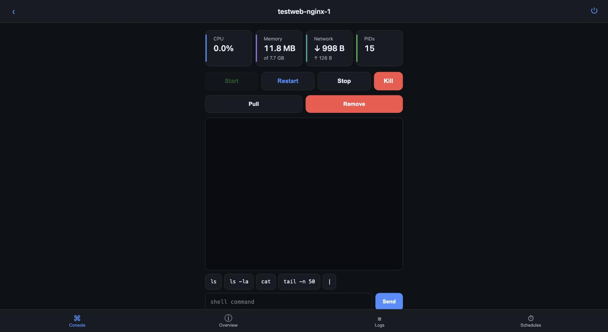
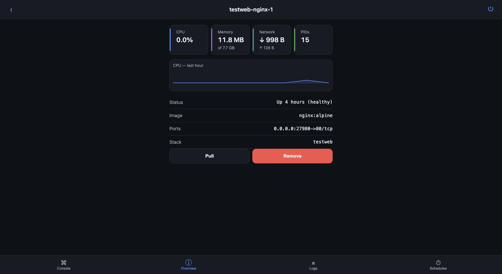

# Macerodactyl

A native **macOS control panel for local Docker containers**, plus an optional
**phone-first web panel** you can reach from anywhere — modeled on Pterodactyl's
information architecture, built for people who run a few real containers (a game
server, a bot, a side project) on a Mac or a small Linux box and want to manage
them without living in the terminal.

[](https://github.com/ctkkoenig/macerodactyl/actions/workflows/ci.yml)
&nbsp;macOS 15+ · Swift 6 · Hummingbird 2 · MIT

<p align="center">
  
  
</p>

> The screenshots show the optional phone web panel. It streams live stats over
> SSE, keeps a bounded metrics history, and drives the same Docker as the native
> app — from your couch.

## Why

Docker Desktop shows you containers; it doesn't give a friend a scoped login to
restart *just their* game server, edit *just its* config file, and watch its logs
— without handing them the keys to your whole machine. Macerodactyl does exactly
that, and it's honest about the security that makes it safe.

## What you get

**Native macOS app**

- A Pterodactyl-style layout: a stack-grouped container list, and a per-container
  workspace with **Console**, **Overview**, **Logs**, **Files**, and **Schedules**.
- Live resource stats (`docker stats`) that read "Unavailable" when the daemon is
  down — never a fake zero.
- Start / restart / stop / **kill**, image **pull**, **recreate** and compose
  **apply**, and container **remove** — each confirmed and audited.
- A real **file manager** confined to each container's stack folder: browse,
  edit (with the right line endings preserved), upload, download, mkdir, rename,
  delete.
- The Minecraft console speaks **RCON** (the real server prompt), not a shell.
- Scheduled restarts via **launchd** that survive quitting the app — the app is
  always safe to close, and it never starts your containers at boot (that's your
  compose restart policies' job).

**Optional web panel** (off by default)

- A phone-first single-page app with a thumb-zone bottom bar, streaming stats and
  logs, log search + download, a file manager, and the full lifecycle controls.
- **Real accounts with per-container permissions** — the whole point (see below).
- Runs in-process with the app, or as a headless daemon, or in a **Docker
  container on Linux** (see [docs/DOCKER.md](docs/DOCKER.md)).

## The security model (the interesting part)

Per-user scoping is *the* boundary, and it's tested, not aspirational:

- Each account gets **per-container** permissions: view / power / files / console
  / schedules / lifecycle. They're independent, but all require view — and
  `lifecycle` (pull/recreate/remove) is kept separate from `power` so "can
  restart" never means "can destroy".
- A scoped user sees **nothing** about containers they aren't granted — filtered
  lists, and **404, not 403**, for an ungranted or non-existent container, so
  existence is never even revealed.
- **File access is confined** to a container's own stack folder (realpath +
  prefix check, symlink-aware). No `..`, percent-encoded, absolute, or symlink
  path escapes it.
- **Identity comes only from the panel's own session** — never a proxy header
  (`X-Forwarded-*`, Cloudflare, Tailscale), so the audit trail is one the app
  owns.
- Passwords are **bcrypt**-hashed; sessions are `HttpOnly` + `SameSite=Lax`
  cookies with a **CSRF** header on every mutating request; failed logins are
  rate-limited and the limit **persists across restarts**.
- The web frontend builds the DOM with safe APIs (`textContent`, never
  `innerHTML` with data), so a missed escape can't become a stored XSS — and a
  test enforces it.

Full policy and reporting: [SECURITY.md](SECURITY.md).

## Getting started

### Run the macOS app from source

Everything except the thin app shell is in the `MacerodactylKit` Swift package,
so you can build and test the core with the Command Line Tools alone:

```sh
cd MacerodactylKit
swift build && swift test
```

To build the app itself you need **Xcode** (macOS 15+):

1. Open `Macerodactyl.xcodeproj`.
2. Select the **Macerodactyl** target → **Signing & Capabilities**.
3. Set **Team** to your personal Apple ID team (Xcode → Settings → Accounts →
   add your Apple ID if needed). This is the step everyone gets stuck on — an
   unsigned build won't launch. A free Apple ID is enough; no paid Developer
   account is required.
4. Build & run (⌘R).

> **Distribution note.** This project is source-only. There's no notarized DMG:
> notarization needs a paid Apple Developer account, and macOS 15 removed the
> Control-click Gatekeeper bypass, so a downloaded unsigned build is a dead end.
> Building from source with your own team is the supported path. (A Homebrew cask
> and a release workflow are prepared under `Casks/` and `.github/workflows/` for
> whoever wants to publish signed builds.)

### Run the web panel on Linux (Docker)

The headless panel is portable. Build the image and point it at your host's
Docker socket and your stacks:

```sh
docker build -t macerodactyl-panel .
docker run -d --name macerodactyl -p 27180:27180 \
  -v /var/run/docker.sock:/var/run/docker.sock \
  -v /srv/stacks:/srv/stacks \
  -v macerodactyl-data:/root/.local/share/Macerodactyl \
  macerodactyl-panel
```

Full instructions (config, first admin, TLS, limitations) are in
[docs/DOCKER.md](docs/DOCKER.md).

## How it's built

- **Swift 6**, macOS 15+. SwiftUI app shell in `App/`; all logic, the web server,
  and tests live in the `MacerodactylKit` local package.
- Talks to the **`docker` CLI** via `Process` (never the socket API), always with
  array arguments — no shell interpolation of user input.
- Web server is **Hummingbird 2**; passwords via **Bcrypt** (hummingbird-auth);
  optional self-signed TLS via **swift-nio-ssl**; SQLite via system `libsqlite3`.
- The web frontend is vanilla HTML/CSS/JS served from the bundle — **no npm, no
  build toolchain**.

## Contributing

Issues and PRs welcome — please read [CONTRIBUTING.md](CONTRIBUTING.md) first, and
report security issues privately per [SECURITY.md](SECURITY.md).

## License

[MIT](LICENSE).
